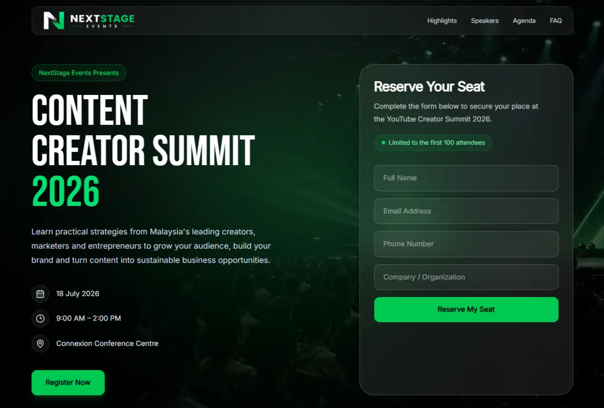
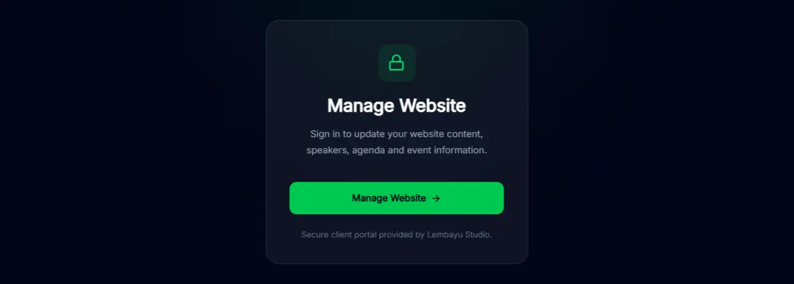

## Preview





# YouTube Creator Summit 2026

A modern event landing page built with React, TypeScript and Tailwind CSS featuring a headless CMS, RSVP system and serverless backend.

> **Disclaimer:** This is a fictional portfolio project created solely for demonstration purposes. The event, speakers, schedule, venue, sponsors and all related content are fictional.

## Live Demo

🌐 Website  
https://nextstage.pages.dev

🔐 Client Portal  
https://nextstage.pages.dev/login

---

## Features

- Modern responsive landing page
- Mobile-first design
- Sanity CMS integration
- Client Portal for content management
- RSVP registration form
- Google Sheets integration
- Confirmation email
- Cloudflare Workers API
- Cloudflare Pages deployment
- Technical SEO
- Lighthouse optimised
- AI discoverability (`llms.txt`)

---

## Tech Stack

### Frontend

- React 19
- TypeScript
- Vite
- Tailwind CSS v4
- Motion
- React Router
- Lucide Icons

### CMS

- Sanity Studio

### Backend

- Cloudflare Workers
- Google Apps Script

### Database

- Google Sheets

### Hosting

- Cloudflare Pages

---

## System Architecture

```text
                React + Vite
                     │
                     ▼
             Cloudflare Pages
                     │
      ┌──────────────┴──────────────┐
      ▼                             ▼
 Sanity Content Lake         Cloudflare Worker
      │                             │
      │                             ▼
      │                    Google Apps Script
      │                             │
      ▼                             ▼
 Dynamic Website             Google Sheets
                                   │
                                   ▼
                         Confirmation Email
```

---

## Project Structure

```text
src/
├── assets/
├── components/
├── features/
├── hooks/
├── layouts/
├── lib/
├── pages/
├── routes/
├── sections/
├── services/
├── styles/
├── types/
└── utils/
```

---

## Getting Started

Clone the repository

```bash
git clone https://github.com/lembayustudio/youtube-creator-summit-2026.git
```

Install dependencies

```bash
npm install
```

Run development server

```bash
npm run dev
```

Build production

```bash
npm run build
```

Preview production build

```bash
npm run preview
```

---

## Environment Variables

Create a `.env.local` file.

```env
VITE_SANITY_PROJECT_ID=
VITE_SANITY_DATASET=production
VITE_SANITY_API_VERSION=
VITE_RSVP_API_URL=
VITE_CMS_URL=
```

---

## Performance

Latest Lighthouse Results

| Category | Score |
|----------|------:|
| Performance (Mobile) | 89 |
| Performance (Desktop) | 100 |
| Accessibility | 100 |
| Best Practices | 100 |
| SEO | 100 |

---

## Client Workflow

```
Client
    │
    ▼
Login Portal
    │
    ▼
Sanity Studio
    │
    ▼
Edit Content
    │
    ▼
Website Updates Instantly
```

---

## Portfolio Notes

This project demonstrates:

- Modern React architecture
- Headless CMS implementation
- Serverless backend
- Dynamic content management
- Responsive UI
- Performance optimisation
- Technical SEO
- Production deployment workflow

---

## Credits

Designed & Developed by **Lembayu Studio**

🌐 https://lembayu.com

---

## License

This repository is provided for portfolio and demonstration purposes only.